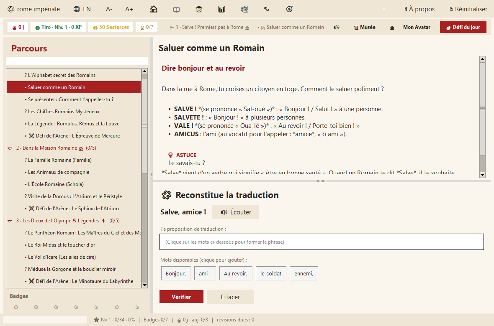
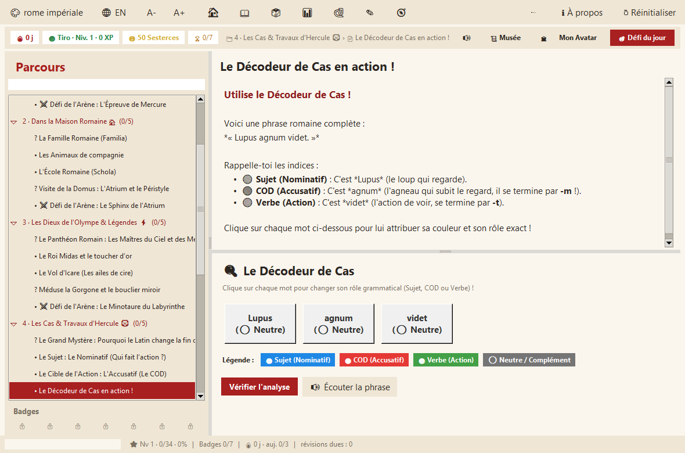
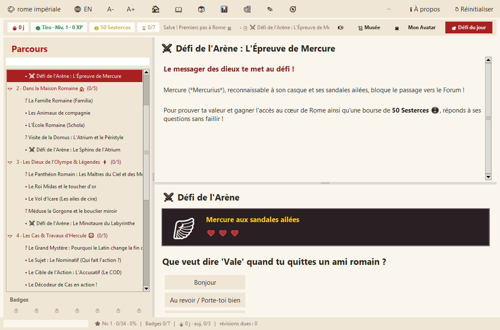
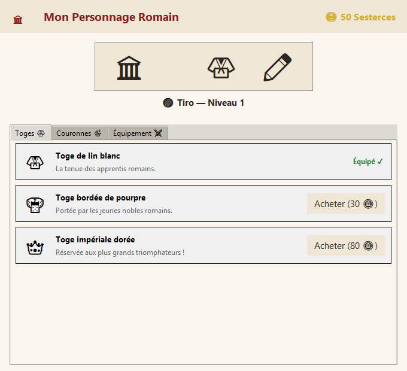
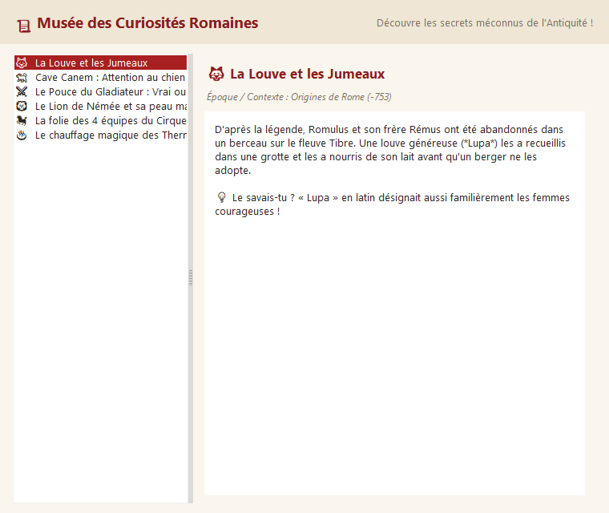

# Ludus Latinus — L'Aventure Romaine 🏛️

**Application éducative pas à pas pour apprendre le latin au collège (niveau 5ᵉ)**  
Conçue et réalisée avec passion — logiciel libre sous licence MIT.

---

## 🌟 Le Concept

**Ludus Latinus** transforme l'apprentissage du latin en une aventure captivante et interactive pour les collégiens :
- **Narratif & immersif** : L'élève débute comme simple recrue (*Tiro*) dans la Rome antique sous l'empereur Auguste, et progresse en accomplissant des quêtes pour devenir *Discipulus*, *Legionarius*, *Centurio* ou *Triumphator*.
- **Activités ludiques adaptées** : Fini le code abstrait ! L'application propose des **Puzzles de mots** (reconstitution de traduction façon Duolingo), des **Textes à trous** tolérants, le **Décodeur de Cas** (analyse visuelle en couleurs : Sujet 🔵, COD 🔴, Verbe 🟢) et des **Combats d'Arène** épiques contre des boss mythologiques (Lion de Némée, Sphinx, Minotaure, Hydre de Lerne).
- **Gamification complète** :
  - Série de jours (Streak 🔥) pour ancrer une habitude de 5 min/jour.
  - Expérience (XP ⚡) et Rangs romains.
  - **Sesterces d'or 🪙** gagnés à chaque réussite pour acheter de l'équipement dans la boutique de son **Avatar** (toges, couronnes de lauriers, bouclier scutum, glaive).
  - **Musée des Curiosités Romaines 📜** débloquant des anecdotes insolites sur la vie quotidienne, Pompéi et les monstres antiques.
  - Système de **Flashcards** et révision espacée.
  - Célébration par **cascade de confettis vectoriels 🎉**.
- **Dimension Sonore & Vocale 🔊** :
  - Effets sonores gratifiants (arpèges de succès, pièces d'or, fanfares).
  - Prononciation vocale des mots et phrases latines (*V* en [ou], *C* en [k]).
  - Bouton Mute en 1 clic dans l'en-tête.
- **Zéro dépendance** : 100 % Python standard (Tkinter, winsound), fonctionne directement sans aucune installation de bibliothèque tierce.

---

## 📚 Les 7 Mondes du Curriculum (Programme officiel de 5ᵉ)

1. **🏛️ Monde 1 · Salve ! Premiers pas à Rome**  
   L'alphabet secret, la prononciation magique, saluer (*Salve ! Vale !*), se présenter (*Quis es ? Nomen mihi est...*), les chiffres romains secrets (I, V, X, L, C, M), la légende de Romulus, Rémus et la louve *Lupa*, et le défi de Mercure aux sandales ailées.

2. **🏠 Monde 2 · Dans la maison romaine (*Domus & Familia*)**  
   La famille (*pater, mater, filius, filia*), les animaux familiers (*canis, felis, equus*), l'école romaine et les tablettes de cire, les pièces de la domus (*atrium, impluvium, triclinium*), et le défi du Sphinx de l'Atrium.

3. **⚡ Monde 3 · Les Dieux de l'Olympe & Légendes**  
   Le panthéon romain (Jupiter, Minerve, Neptune, Mars, Vénus), le roi Midas et le toucher d'or, le vol d'Icare et les ailes de cire, le regard pétrifiant de Méduse, et le combat contre le Minotaure du Labyrinthe.

4. **🦁 Monde 4 · Les Cas & Travaux d'Hercule**  
   Pourquoi le latin change la fin des mots, le Nominatif (Sujet 🔵) vs l'Accusatif (COD 🔴 avec son -m), la 1ʳᵉ déclinaison (*puella, rosam*), le Décodeur de Cas en action, et le combat contre le Lion de Némée.

5. **⚔️ Monde 5 · Les Verbes au Présent & L'Action**  
   Le verbe ÊTRE (*sum, es, est, sumus, estis, sunt*), les verbes du 1er groupe (*amare*), les verbes d'action des héros (*pugnat, vincit, currit*), et le défi contre l'Hydre de Lerne.

6. **🛡️ Monde 6 · Les Gladiateurs & le Colisée**  
   Rétiaires (trident et filet), Mirmillons (bouclier et casque à crête), courses de quadriges au Circus Maximus, le salut historique *« Ave Caesar, morituri te salutant ! »*, et le duel contre le Champion du Colisée.

7. **📜 Monde 7 · Détective des Mots & Devises**  
   Retrouver l'origine latine de 80% des mots français (*aqua, terra, manus, pes*), les préfixes magiques (*sub-, trans-, post-*), les citations immortelles (*Veni, vidi, vici*, *Alea jacta est*, *Carpe diem*), et le grand examen devant le Sénat de Rome.

---

## 🚀 Lancer l'application

Il suffit d'avoir Python 3.10 ou plus installé sur votre machine :

```bash
python main.py
```

### Options utiles en ligne de commande :
- `python main.py --version` : Affiche le nom et la version de l'application.
- `python main.py --check` : Contrôle de santé complet de l'installation.
- `python -m unittest discover tests` : Lance la suite complète de 143 tests unitaires.

---

## 📸 Captures d'écran

| Leçon & Puzzle de Traduction | Décodeur Grammatical de Cas |
| :---: | :---: |
|  |  |

| Combat d'Arène contre un Boss | Boutique & Avatar Romain | Musée des Curiosités |
| :---: | :---: | :---: |
|  |  |  |

